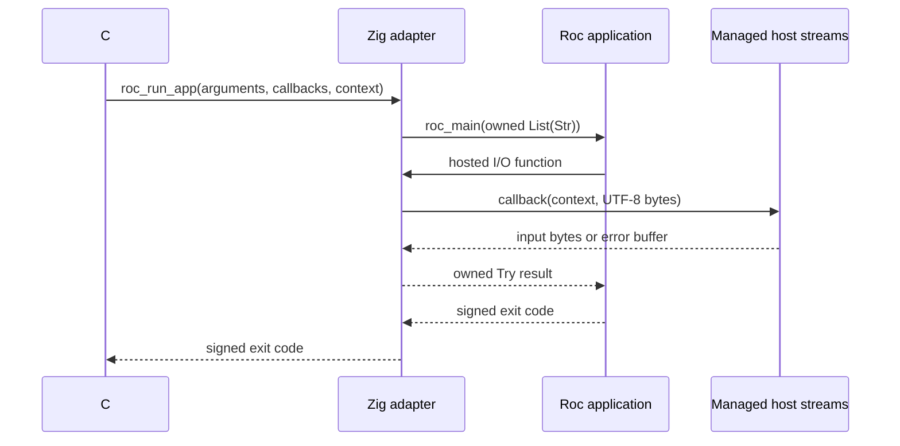

# Embed Roc in .NET

> This is a quick demonstration created on 8 October 2026 to share the end-to-end flow and setup for embedding Roc in .NET. It is not intended to be maintained or supported beyond that date.

A Roc application builds into a shared library containing its compiled code and a Zig platform adapter. The reusable .NET 10 library loads that plugin and supplies managed implementations of the platform's I/O effects. The call flow is **C# → Zig adapter → Roc → Zig adapter → managed effect**.

The public C# interface is deliberately small: load a `RocPlugin`, provide a `RocHost` for each run, and receive an exit code. This platform demonstrates a synchronous application entry point with arguments and standard I/O. A plugin exposing domain-specific operations would define those operations in its Roc platform and native contract.

## Roc terminology and the contract

Roc separates an **application** from its **platform**. The application supplies the behavior to run. The platform defines the Roc API available to that application and a **host**, written outside Roc, which implements I/O and memory management. Roc's standard library supplies functions and data structures; the selected platform supplies I/O. Here, the host implementation spans the Zig adapter and its managed callbacks.

The declarations in [platform/main.roc](platform/main.roc) describe both directions of that relationship:

| Declaration | Meaning in this demonstration |
| --- | --- |
| `requires` | The application must implement `main! : List(Str) => Try({}, [Exit(I32), ..])`. |
| `exposes` | Applications may import `Stdout`, `Stderr`, and `Stdin` from their platform alias. |
| `provides` | Compiled Roc exposes `main_for_host!` under the native symbol `roc_main`, which Zig calls. |
| `hosted` | Host-implemented symbols such as `roc_stdout_line` supply the implementations of `Host.stdout_line!` and the other hosted declarations. |
| `targets` | Roc links a target's prebuilt adapter with the compiled app and produces a `Shared` library exporting `roc_run_app`. |

An **effectful function** may perform I/O or other side effects. Its type uses `=>`, and its name conventionally ends in `!`. The public `Stdout.line!` wrapper calls a **hosted function** in the private `Host` type module. A hosted declaration has a type annotation and no Roc body; its implementation comes from the host symbol named in the platform's `hosted` section. The `[]` types in these API modules are namespaces with no values to construct.

`Try` expresses success as `Ok(value)` or failure as `Err(error)`. The `?` operator propagates an error to the caller. Applications can also handle those errors explicitly. `Exit(code)` is an application result consumed by this platform; it does not itself terminate the .NET process. The empty record `{}` carries no data, so `Ok({})` represents successful completion.

These terms follow Roc's language reference: [platforms](https://github.com/roc-lang/roc/blob/main/docs/langref/platforms.md), [modules and hosted functions](https://github.com/roc-lang/roc/blob/main/docs/langref/modules.md), [effectful functions](https://github.com/roc-lang/roc/blob/main/docs/langref/functions.md), and [doc comments](https://github.com/roc-lang/roc/blob/main/docs/langref/comments-and-docs.md).

## Requirements

Consumers of a packaged platform need the Roc `nightly-2026-10-04-130536d` compiler and .NET 10 SDK. Rebuilding the platform additionally needs Zig 0.16.0. Automation is written in Roc using the basic-cli 0.24.0 platform and the same pinned compiler. Roc handles bundling and archive extraction directly. The committed Linux x64 Nix shell supplies the tools and checksum-pins the Roc binary:

```sh
nix develop
```

On native Windows x64, install the .NET 10 SDK and the same Roc nightly. Install Visual Studio C++ Build Tools and the Windows SDK, and use a shell with the x64 C++ build environment available so Roc can link the MSVC target. The CI bundle already contains the Windows adapter, so consuming it needs no Zig build. Serving and smoke checks use the Roc scripts in this repository.

## Build and run

From the repository root, build both native adapter archives and all managed projects:

```sh
zig build -Doptimize=ReleaseSafe
dotnet build RocEmbedding.slnx
roc build examples/hello_world/main.roc --output=hello_world.so
dotnet run --project dotnet-host -- hello_world.so
```

That prints `Hello, World!`. Each checked-in example is a standalone application referencing `../../platform/main.roc`. For the full I/O example on Linux:

```sh
roc build examples/effects/main.roc --output=effects.so
dotnet run --project dotnet-host -- effects.so "first argument" "second argument"
```

Enter a line on standard input. The application prints its arguments and that line to standard output, writes a Unicode message to standard error, and returns 0. The `exit` example returns 42. `RocPlugin.Run` receives exactly the supplied argument strings; the CLI consumes the library-path argument and forwards the remainder without adding a program name.

The platform selects shared-library output, so consumers use ordinary `roc build`. On Windows, choose an output ending in `.dll` and pass that path to the same managed CLI. Relative library paths are resolved from the current working directory.

## Use a plugin from C#

Reference `dotnet-plugin/Roc.Hosting.csproj` from your application. Load the plugin once and supply a host for each synchronous invocation:

```csharp
using Roc.Hosting;

using var plugin = RocPlugin.Load(libraryPath);
var host = new RocHost(Console.In, Console.Out, Console.Error);
int exitCode = plugin.Run(host, "first argument", "second argument");
```

For an embedded caller, the same loaded plugin can run against in-memory streams:

```csharp
using var input = new StringReader("hello from .NET\n");
using var output = new StringWriter();
using var error = new StringWriter();
int exitCode = plugin.Run(new RocHost(input, output, error), "example");
string capturedOutput = output.ToString();
```

`RocPlugin` owns the native library through a `SafeHandle`. The caller owns the host streams, which stay open after a run or plugin disposal. Each invocation owns its callback context and temporary UTF-8 buffers. Public APIs use ordinary .NET types; unsafe ABI declarations and unmanaged callbacks are internal to the library. The project generates XML documentation beside its managed assembly for use by editors.

`Input` uses `TextReader.ReadLine`, and `Output` and `Error` use `TextWriter.WriteLine` for the Roc line effects. The writer supplies its newline policy. Runtime diagnostics use `Error.Write` because the diagnostic text already contains its line breaks. The reader strips the input line ending; EOF becomes an empty Roc string, so this API deliberately gives an empty line and EOF the same representation. The CLI configures UTF-8 for redirected console streams.

Runs and all callbacks complete synchronously on the calling thread. A loaded plugin can run repeatedly with different hosts. The managed library permits one invocation at a time across the process, including calls through separate `RocPlugin` objects, and rejects concurrent or recursive runs with `InvalidOperationException`. Disposing a running plugin also throws; disposal neither cancels nor waits for the run. Repeated disposal is harmless, and using a disposed plugin throws `ObjectDisposedException`.

## Native boundary and ownership

The managed ABI uses C calling conventions, pointer-and-length UTF-8 buffers, a callback table, and an opaque invocation context. Lengths count bytes, with no required NUL terminator. The context is a `GCHandle` that keeps the invocation and its host reachable while native code executes. The callback table remains on the managed stack for that call; Zig retains neither it nor the context after returning.



There are three memory domains. Ordinary .NET strings and the caller's readers/writers are managed objects. Temporary UTF-8 transfer buffers are unmanaged `NativeMemory` allocations tracked by the invocation and freed through its release callback or cleanup. Roc values use native layouts and Roc ownership rules, with allocations supplied by the platform's allocator. A Roc string is therefore distinct from both a .NET string and a transfer buffer.

The native adapter knows Roc's memory layouts and reference-counting rules. An **owned reference** is a reference the current owner must eventually release or transfer. A **borrow** allows access while the owner keeps a value alive, without transferring that obligation. For refcounted Roc allocations, releasing the final owned reference frees the allocation. Inline small strings and static values follow the generated glue's own release rules. The generated Zig `RocHost`/`RocEnv` values are internal helper contexts for this allocator and diagnostics; they are distinct from the public C# `RocHost` and are not passed to compiled Roc code.

Roc calls context-free runtime symbols such as `roc_alloc` and `roc_dbg`. The adapter's small forwarding functions attach the current helper context and delegate to the generated allocation/diagnostic implementations. The allocator uses Zig's portable `page_allocator` policy. Creating a context per invocation does not create an arena: Roc allocations are released through their ownership rules and deallocation calls, with no automatic bulk reset at the end of a run.

Keeping Roc storage native makes those ownership rules direct. Using GC arrays would require rooting, pinning, alignment handling, and an explicit deallocation policy. Allocator callbacks backed by C# `NativeMemory` would still allocate native storage and retain its explicit lifetime, while adding managed/native crossings. The managed garbage collector owns the .NET objects surrounding the invocation; it does not own Roc's allocations.

| Value crossing the boundary | Ownership and release |
| --- | --- |
| Managed argument buffers | The invocation owns them. Zig borrows their bytes, copies them into Roc `Str` values, and transfers the resulting `List(Str)` to `roc_main`. Managed buffers are freed after the run; Zig must not release the transferred Roc list again. |
| Roc strings supplied to hosted output | Roc transfers one owned reference to Zig. The managed callback borrows its UTF-8 bytes for that callback only; Zig releases its Roc reference afterward. |
| Managed input or callback-error buffers | The invocation allocates them. Zig copies their bytes into a Roc-owned result and calls the managed release callback before resuming Roc. |
| Callback context and library handle | The invocation roots the managed context and retains the native library for the entire call. Context and buffers are cleaned up on return; the plugin retains its library handle until disposal. |

A null returned error pointer means a callback succeeded. A non-null pointer means failure, even for an empty error message; this is why empty managed buffers still receive an allocation. The stdin callback returns input through a separate output parameter and uses its return buffer only for an error. Each buffer allocated by the invocation is tracked to prevent an unknown or repeated release; remaining allocations are reclaimed when the invocation ends.

## Results and failure behavior

The platform converts the application's result into a signed `int` returned by `RocPlugin.Run`:

| Roc application result | Managed result |
| --- | --- |
| `Ok({})` | 0 |
| `Err(Exit(code))` | The exact signed `I32` code |
| Any other unhandled `Err` | A best-effort error line on managed stderr and -1 |

An exception from a managed I/O implementation becomes `StdoutErr(message)`, `StderrErr(message)`, or `StdinErr(message)`. Roc may recover from that `Try` error. If the application propagates it with `?`, the platform applies the unhandled-error behavior above. No managed exception may unwind through Zig or Roc. An exception while constructing a callback's error buffer is fatal because the callback can no longer satisfy its native contract.

The `dbg` and failed-`expect` diagnostic hooks return normally. Roc crashes and Roc allocation failures terminate the process through the adapter. Diagnostic writes are best-effort: their failures have no application `Try` result and are released without recursively reporting another diagnostic. Managed validation or loading errors remain managed exceptions. The CLI reports those errors and returns 1; missing CLI arguments return 2. Its process exit code is subject to the operating system's exit-code representation, while `RocPlugin.Run` preserves the signed integer.

This fixed ABI has no version negotiation. `Load` resolves `roc_run_app`, and callers must supply a library built for this platform and the matching architecture. Application exit codes are not separate transport statuses: an app may itself return -1. The native adapter also returns -2 on a direct overlapping native call, which collides with a legitimate application exit code; the managed invocation guard rejects overlap before entering that path. Adding typed domain operations, asynchronous callbacks, or cancellation would require an expanded contract.

## Bundle and serve the platform

The Linux packaging flow builds both target adapters, stages the Roc API and license, and asks Roc to produce its content-addressed archive:

```sh
zig build -Doptimize=ReleaseSafe
roc scripts/bundle.roc
```

The script prints the generated archive path, preserves Roc's filename, and uses `roc unbundle` to verify that both `targets/x64musl/libhost.a` and `targets/x64win/host.lib` are present. Zig builds ordinary archives containing the adapter's object bytes and copies them into those target paths. Consumers need no object files from the packaging machine's build cache.

Serve the printed archive in another terminal:

```sh
roc scripts/serve.roc -- <archive.tar.zst>
```

The server listens on an ephemeral loopback port, prints the complete archive URL, and serves that archive until interrupted. Requests for another filename receive 404.

Alternatively, download the `roc-dotnet-platform` CI artifact and pass its archive path to the same script. Create `some_app.roc` using the server's URL and the generated archive's exact filename:

```roc
app [main!] { roc: "nightly-2026-10-04-130536d", pf: platform "http://127.0.0.1:<port>/<hash>.tar.zst" }

import pf.Stdout

main! : List(Str) => Try({}, [Exit(I32), StdoutErr(Str)])
main! = |_args| {
    Stdout.line!("Hello from a packaged platform!")?
    Ok({})
}
```

Replace the example platform URL with the URL printed by the server. On Linux:

```sh
roc build some_app.roc --output=some_app.so
dotnet run --project dotnet-host -- some_app.so
```

On Windows, using the same served bundle:

```powershell
roc build some_app.roc --output=some_app.dll
dotnet run --project dotnet-host -- .\some_app.dll
```

The consumer's Roc compiler selects the compatible target and links its already-built adapter. The HTTP server and the resulting shared library serve different purposes: the server distributes platform build inputs; the .NET caller loads the app-specific library from disk.

## Repository guide

| Path | Responsibility |
| --- | --- |
| `platform/` | Roc platform declaration, exposed type modules, private hosted declarations, and generated target archives. |
| `host-shim/host.zig` | Converts managed bytes to Roc values, implements hosted effects and runtime symbols, and exports `roc_run_app`. |
| `host-shim/roc_platform_abi.zig` | Compiler-generated declarations and helpers for Roc layouts and owned-reference release rules. |
| `dotnet-plugin/` | Reusable `Roc.Hosting` library: public `RocPlugin` and `RocHost`, internal library lifetime, native ABI, and invocation callbacks. |
| `dotnet-host/` | Console policy and argument forwarding through the public managed API. |
| `dotnet-tests/` | Integration smoke runner for the public managed API, separate from the CLI. |
| `examples/` | Standalone hello-world, managed I/O, and explicit-exit Roc applications. |
| `scripts/` | Roc applications on basic-cli for platform bundling, HTTP serving, glue regeneration, and smoke checks. |
| `RocEmbedding.slnx` | Builds all managed projects with `dotnet build` from the repository root. |

## Regenerate the Roc ABI glue

[host-shim/roc_platform_abi.zig](host-shim/roc_platform_abi.zig) is generated from the platform declarations, rather than a manually designed managed interface. Its types and ownership helpers must match the Roc compiler used to build applications. Regenerate it when platform declarations or the compiler pin change:

```sh
roc scripts/regenerate_glue.roc
```

The workflow verifies the compiler's nightly version and uses the vendored compiler-matched Zig glue generator under `scripts/glue/`. Its [provenance and checksum](scripts/glue/README.md) are recorded there. Raw output overwrites `host-shim/roc_platform_abi.zig`. Changing the compiler pin also requires updating the vendored generator to the corresponding upstream revision. Keep the generated output reproducible; teaching comments belong in the adapter, the API modules, and this README rather than manual changes to generated layouts.

## Validation and tested versions

Run the same bundle-consumption smoke used by CI inside the Nix shell:

```sh
roc scripts/smoke.roc -- <archive.tar.zst>
```

The script serves the supplied archive on an ephemeral localhost port, verifies an HTTP fetch of the exact bytes, and builds temporary copies of all examples whose platform declarations contain that URL. Their build directories and Roc caches are fresh. Temporary files and the server are cleaned up when the run finishes. These checks exercise the required export, hello-world output, arguments, managed stdin/stdout/stderr, Unicode, empty and long strings, EOF, nonzero exits, managed I/O failures, repeated invocations, invocation guards, disposal, and unload/reload. Subprocess checks also verify the documented CLI with redirected console streams.

CI builds one platform bundle on Linux and downloads that same artifact in `ubuntu-24.04` and `windows-2022` smoke jobs. Neither smoke job rebuilds the adapter. Local Linux validation passed inside Nix. Native Windows consumption is configured in CI and has not been validated locally.

The complete regeneration/build/package/consumption workflow is also available as:

```sh
roc scripts/check_all.roc
```

This regenerates glue in a temporary workspace, compares it with the checked-in file, builds both adapters from the fresh generated output, bundles them, and runs the HTTP/managed smoke checks. It fails on stale glue instead of silently updating the checked-in file.

CI uses an explicit packaging mode to run regeneration, compilation, and bundling into an output directory:

```sh
roc scripts/check_all.roc -- --package-only bundle
```

Its separate Linux and Windows consumer jobs run `smoke.roc` against the resulting artifact. The default command without arguments always includes the full smoke checks.

The tested toolchain is Roc `nightly-2026-10-04-130536d`, Zig 0.16.0, and .NET 10, with basic-cli 0.24.0 for repository automation. Local correctness validation uses `ReleaseSafe` for the Zig adapters; performance investigations should use `ReleaseFast`, retain debug symbols when profiling, and report that build mode. Generated archives, app libraries, and build output are ignored by Git.
